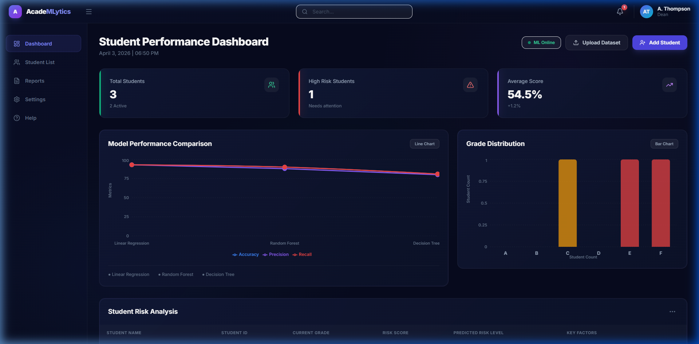
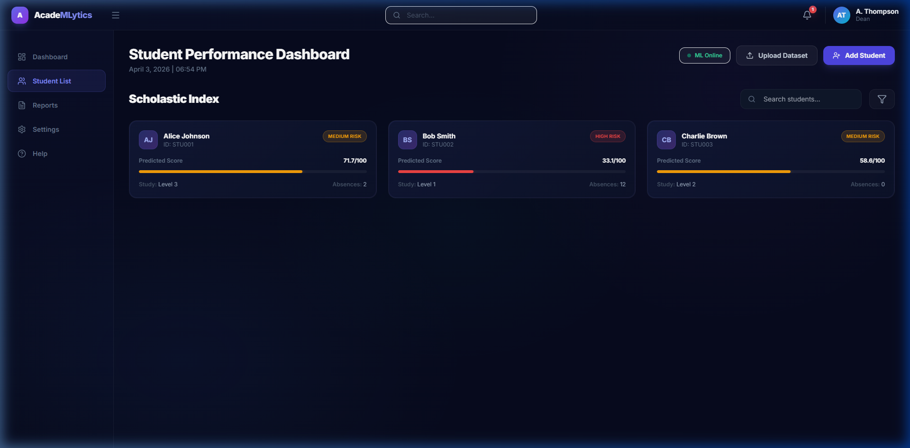
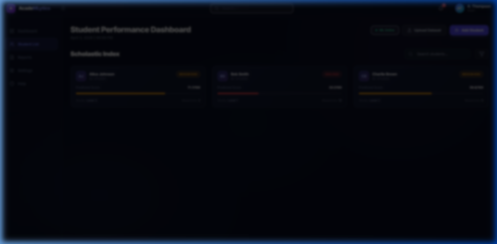
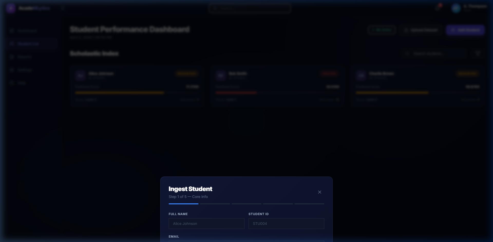

<div align="center">
  
</div>

<h1 align="center">AcadeMLytics</h1>
<p align="center">
  <em>Real-time Student Performance & Risk Intelligence System</em>
</p>

## ✨ Features

- **Dashboard Analytics**: Real-time KPI cards, model accuracy comparisons, and student grade distribution charts.
- **Predictive Risk Analysis**: Identify high-risk students and the key factors contributing to their predicted scores.
- **Bulk Dataset Upload**: Drag-and-drop CSV importer with real-time client-side validation and immediate Convex sync.
- **ML Engine**: Scikit-Learn based machine learning models (Random Forest, Decision Tree, Logistic Regression) served via a high-performance FastAPI microservice.
- **Reactive UI**: End-to-end reactivity powered by Convex, enabling instant updates across all clients when new students are ingested or predictions are made.

<details open>
  <summary><b>👀 Visual Walkthrough (Click to expand)</b></summary>
  
  ### Student Risk Roster
  

  ### Dataset Bulk Upload
  

  ### Single Student Ingestion
  
</details>

---

## 🛠 Required Technologies & Architecture

AcadeMLytics uses a modern, modular architecture separated into a reactive frontend, a real-time reactive backend, and a dedicated machine learning microservice.

### **Frontend**: React (Vite) + Tailwind CSS + Recharts
- **Why?** React provides quick component-based rendering. Tailwind enables the custom premium glassmorphism dark theme rapidly. Recharts builds the dynamic, responsive model comparison and grade distribution graphs natively in React. 

### **Backend & Database**: Convex
- **Why?** Convex replaces the entire backend boilerplate (database, API layer, state synchronization). Its real-time subscriptions mean that when the ML service finishes processing a batch query, the frontend dashboard updates immediately without needing websockets or manual polling. We utilize Convex Actions to safely call our external ML microservice.

### **ML Microservice**: FastAPI + Python (scikit-learn)
- **Why?** Python is the industry standard for ML. By isolating it behind a FastAPI endpoint, our Node-based backend logic isn't bogged down by heavy dataset training jobs. FastAPI provides lightning-fast asynchronous endpoints for `/predict`, `/train-all`, and `/health`.

---

## 🧭 Architecture Flow

1. **Ingestion Flow**
   * Administrator adds a single student (via the Modal) or a CSV bulk dataset.
   * The React client performs schema validation and fires a mutation to Convex.
   * Convex inserts the pristine records into the real-time database, guarded by indexes to prevent duplicate student IDs.

2. **Prediction Flow**
   * After data ingestion, an Administrator clicks *Predict All* (or *Predict Now* for single students).
   * A Convex Action fetches the raw data, formats it, and makes a POST request to the Python FastAPI microservice.
   * The ML microservice runs the selected Active Model against the data and returns the projected scores and risk factors.
   * The Convex Action writes these predictions back into the database. The React UI instantly updates via its active subscription.

3. **Training Flow**
   * The *Retrain Models* feature triggers the ML microservice to retrain all internal algorithms against the current live student dataset.
   * Results (R², Accuracy, F1, MAE) are sent back to Convex and rendered on the Comparison Chart so admins can confidently select the active prediction engine.

---

## 🚀 Running Locally

### 1. Start the Machine Learning Microservice
Ensure you have Python installed, then navigate to the ML service directory to spin it up:
```bash
cd ml-service
pip install -r requirements.txt
python main.py
```
*The service will spin up on `http://localhost:8000`.*

### 2. Start the Backend (Convex)
Open a new terminal session, navigate to the project root, and run the Convex dev server:
```bash
npx convex dev
```
*This starts your persistent cloud backend and provides the `.env` URL automatically.*

### 3. Start the Frontend
Open a final terminal session in the frontend folder:
```bash
cd frontend
npm install
npm run dev
```
*The React app will be live at `http://localhost:5173`.*
