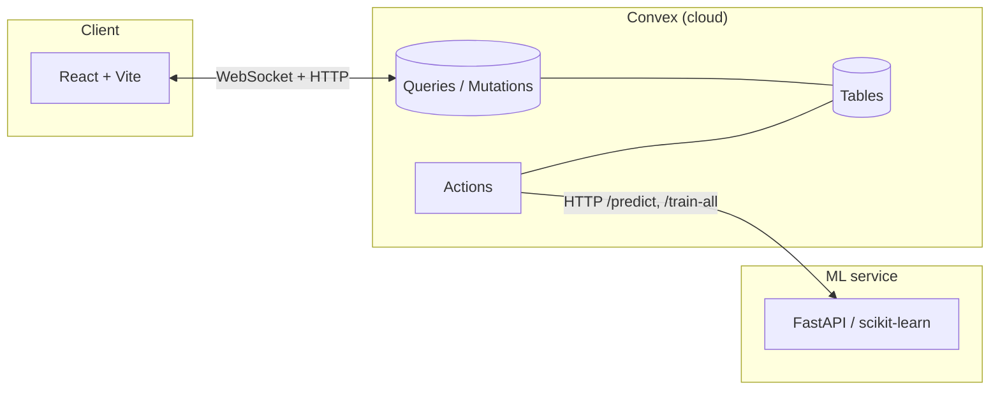

<div align="center">


# AcadeMLytics

**Real-time student performance analytics & risk intelligence** — ingest cohorts, train regression models, and surface predictions through a reactive dashboard backed by Convex and a dedicated ML API.

<br>

[](https://react.dev/)
[](https://www.typescriptlang.org/)
[](https://vitejs.dev/)
[](https://tailwindcss.com/)

[](https://convex.dev/)
[](https://fastapi.tiangolo.com/)
[](https://scikit-learn.org/)
[](https://docs.docker.com/compose/)

[](https://nodejs.org/)
[](https://www.python.org/)

*JavaScript/TypeScript dependency **versions** above are taken from **`frontend/package-lock.json`** (e.g. `react@19.2.4`, `vite@8.0.3`, `typescript@5.9.3`, `tailwindcss@3.4.19`, `convex@1.34.1`, `recharts@3.8.1`). Root **`package-lock.json`** pins `concurrently@9.2.1`. **`package.json`** files use semver ranges (`^` / `~`); reinstalling can bump patches within those ranges unless the lockfile is enforced.*

*Python packages in **`ml-service/requirements.txt`** are **unpinned** (no `==`): `pip` installs current compatible releases at install time—document your own `pip freeze` if you need reproducible ML builds.*

</div>

---

## Table of contents

- [Overview](#overview)
- [Versions and reproducibility](#versions-and-reproducibility)
- [Features](#features)
- [Screenshots](#screenshots)
- [Architecture](#architecture)
- [Technology stack](#technology-stack)
- [Prerequisites](#prerequisites)
- [Getting started](#getting-started)
- [Environment variables](#environment-variables)
- [Docker](#docker)
- [Data & CSV format](#data--csv-format)
- [NPM scripts](#npm-scripts)
- [Repository layout](#repository-layout)
- [Troubleshooting](#troubleshooting)

---

## Overview

AcadeMLytics is a full-stack application for **managing student records**, **bulk-importing UCI/Kaggle-style CSVs**, **training scikit-learn regressors** (linear, random forest, decision tree), and **visualizing risk and performance** in a dark glassmorphism UI. The frontend subscribes to **Convex** in real time; **Convex Actions** call the **FastAPI** ML service for training and batch prediction.

---

## Versions and reproducibility

| Artifact | What it pins | Honest notes |
|----------|----------------|-------------|
| **`frontend/package-lock.json`** | Exact npm tree for the UI (`vite`, `react`, `convex`, etc.) | **Source of truth** for the badge versions in the header. |
| **`package-lock.json`** (root) | `convex`, `concurrently` | Used for `npm run dev:full` and Convex CLI dependency. |
| **`frontend/package.json`** | Caret/tilde ranges | Declares *minimum* compatible versions; lockfile decides what actually installs. |
| **`ml-service/requirements.txt`** | **No** pins | Versions float; different machines can get different sklearn/numpy builds. Use `pip freeze > requirements.lock.txt` in your project if you need bit-for-bit ML reproducibility. |
| **`.nvmrc`** | `22` | Suggested Node line for local dev; `engines` in root `package.json` still allows any **≥22 &lt;25**. |

**Convex:** Product limits (mutation runtime, bandwidth, plan features) are defined by **Convex** and your deployment plan—not this repo. Bulk CSV import is intentionally **chunked** so each mutation stays within typical execution limits.

---

## Features

| Area | Capabilities |
|------|----------------|
| **Dashboard** | KPI cards, model comparison charts, grade distribution, student risk table |
| **Students** | Roster, per-student actions, guided single-student ingest (multi-step form) |
| **Data** | CSV drag-and-drop, column mapping with synonyms, optional imputation, chunked import |
| **Fresh runs** | “Start fresh” on import or **Settings → Clear all** to wipe students, predictions, and metric history |
| **ML** | Retrain on live data, **Predict all**, optional per-student prediction (requires ML URL reachable from Convex) |
| **Ops** | One-command local dev (`dev:full`), Docker Compose for UI + ML service |

---

## Screenshots

<p align="center">
  
</p>

<details>
<summary><strong>More views (click to expand)</strong></summary>

### Student risk roster


### Dataset bulk upload


### Single-student ingest


</details>

---

## Architecture



1. **Ingest** — UI validates CSV → Convex **mutations** insert students (deduped by `studentId`).
2. **Train / predict** — **Actions** pull features, POST to the ML service, write **predictions** and **modelMetrics**.
3. **UI** — Subscriptions refresh KPIs and charts without manual polling.

> **Note:** Convex runs in the cloud. Point **`ML_SERVICE_URL`** (Convex env) at a URL that reaches your ML API (e.g. tunnel to `localhost:8000`); `localhost` inside a Convex action refers to Convex’s network, not your laptop.

---

## Technology stack

### Frontend (`frontend/`)

| Layer | Technologies |
|--------|----------------|
| **Framework** | React **19.2.4**, TypeScript **5.9.3**, Vite **8.0.3** (*from* `frontend/package-lock.json`) |
| **Styling** | Tailwind **3.4.19**, custom glass theme, Framer Motion **^12.38.0** |
| **UI primitives** | Radix UI (Dialog, Select, Tabs, …) |
| **Data** | Convex JS **1.34.1**, real-time queries |
| **Charts** | Recharts **3.8.1** |
| **CSV** | Papa Parse **^5.5.3** |

### Backend & data (`convex/`)

| Layer | Technologies |
|--------|----------------|
| **BaaS** | Convex **^1.34.1** — schema, queries, mutations, actions |
| **Access** | No built-in end-user auth in this repo; anyone with your Convex deployment URL can use the API surface you deploy (treat `VITE_CONVEX_URL` as sensitive). |
| **Integrations** | `ML_SERVICE_URL` on the Convex deployment for outbound HTTP to the ML service |

### ML service (`ml-service/`)

| Layer | Technologies |
|--------|----------------|
| **API** | FastAPI, Uvicorn (**versions unpinned** in `requirements.txt`) |
| **ML** | scikit-learn regressors: `LinearRegression`, `RandomForestRegressor`, `DecisionTreeRegressor` |
| **Data** | pandas, NumPy (versions unpinned) |

### DevOps

| Layer | Technologies |
|--------|----------------|
| **Containers** | Docker Compose (frontend nginx build + ML service) |
| **Automation** | `concurrently` **9.2.1** (root `package-lock.json`) for `convex dev` + Vite |

---

## Prerequisites

- **Node.js** ≥ 22 and &lt; 25 ([`.nvmrc`](.nvmrc))
- **npm** (or compatible client)
- **Convex account** and CLI (`npx convex`)
- **Python 3.x** for local ML (optional if you only use ingestion)
- **Docker** (optional) for Compose-based UI + ML

---

## Getting started

### 1. Install dependencies

```bash
# Repository root
npm install

# Frontend
cd frontend && npm install && cd ..
```

### 2. Align Convex URLs

- **Root** [`.env.local`](.env.local): `CONVEX_URL` (e.g. `http://127.0.0.1:3210` for local backend).
- **Frontend** [`frontend/.env.local`](frontend/.env.example): `VITE_CONVEX_URL` must match **`CONVEX_URL`** (same deployment).

Copy from [`frontend/.env.example`](frontend/.env.example) if needed.

### 3. Run Convex + UI (recommended)

From the **project root**:

```bash
npm run dev:full
```

This runs **`convex dev`** and **`npm run dev`** (Vite) together. Open the URL Vite prints (often `http://localhost:5173`).

### 4. Run the ML service (training / predictions)

```bash
cd ml-service
pip install -r requirements.txt
python main.py
```

Service listens on **`http://0.0.0.0:8000`** — verify with **`GET /health`**.

### Alternative: separate terminals

| Step | Command |
|------|---------|
| Convex | `npm run convex:dev` or `npx convex dev` |
| Frontend | `npm run dev` (from root) or `cd frontend && npm run dev` |
| ML | `cd ml-service && python main.py` |

---

## Environment variables

| Location | Variable | Purpose |
|----------|----------|---------|
| Project root `.env.local` | `CONVEX_URL`, `CONVEX_DEPLOYMENT` | Convex CLI / local backend |
| `frontend/.env.local` | `VITE_CONVEX_URL` | Convex URL for the React client (**must match** `CONVEX_URL`) |
| Docker `.env` | `VITE_CONVEX_URL` | Build-arg for production frontend image |
| **Convex Dashboard / CLI** | `ML_SERVICE_URL` | Base URL of the FastAPI service for **actions** (e.g. `https://…` via tunnel) |
| `ml-service/.env` | `HOST`, `PORT`, `DEBUG` | Optional local hints (entrypoint may hardcode host/port) |

See [`docker-compose.env.example`](docker-compose.env.example) for Compose-related variables.

---

## Docker

Convex is **not** run inside Docker; only the **frontend build** and **ML service** are.

1. Copy `docker-compose.env.example` → `.env` and set **`VITE_CONVEX_URL`** to your Convex deployment URL.
2. Run:

```bash
npm run docker:up
```

- App: **`http://localhost:8080`** (configurable via `FRONTEND_HOST_PORT`)
- ML health: **`http://localhost:8000/health`**

Stop: `npm run docker:down`

---

## Data & CSV format

- **File**: `.csv` with a **header row**; UTF-8 text.
- **Shape**: Aligned with **student performance** / UCI-style features (demographics, family, study habits, grades, etc.). Same column universe as [`convex/schema.ts`](convex/schema.ts) (e.g. `studentId`, `previousMarks`, `Medu`, …).
- **Mapping**: UI suggests mappings from synonyms (e.g. `G3`, `marks` → `previousMarks`). Missing cells can use **defaults** and optional **imputation**.
- **Identity**: Each **`studentId`** must be unique in the database. Within a single import **chunk**, duplicate IDs in the CSV are **collapsed** (last row wins). IDs that **already exist** in Convex are **skipped** (counted in the skip total).

### Practical limits (orders of magnitude)

| Limit | What it is |
|--------|------------|
| **Convex `array` args** | Up to **8192** elements per function argument ([Convex docs](https://docs.convex.dev/database/schemas#validators)). The UI never sends that many rows in one mutation—it uses **chunks of 25** per `batchCreate` call. |
| **Mutation duration** | Convex caps **wall-clock time** per mutation (plan-dependent, often ~**1s** on dev). Chunked imports exist so large files stay under that budget. |
| **Browser / memory** | Very large CSVs are read fully in the browser for parsing; **hundreds of thousands of rows** may be slow or run out of memory—split the file if needed. |
| **Column count** | No hard app limit; use one column per mapped field. Extremely wide CSVs are still parsed as text. |
| **Python ML** | Training loads the **current student table** from Convex into pandas—very large tables increase RAM use in `ml-service`. |

Use **Upload Dataset → Start fresh** (preview step) or **Settings → Clear all students & insights** to reset before a new cohort.

---

## NPM scripts

| Script | Description |
|--------|-------------|
| `npm run dev` | Vite dev server only (`frontend/`) |
| `npm run dev:full` | `convex dev` + Vite (via `concurrently`) |
| `npm run convex:dev` | Convex dev sync |
| `npm run convex:seed` | Seed helper script |
| `npm run docker:up` / `docker:down` / `docker:logs` / `docker:config` | Docker Compose helpers |

---

## Repository layout

```
├── convex/           # Schema, queries, mutations, actions, init/clearData
├── frontend/         # React + Vite + Tailwind app
├── ml-service/       # FastAPI + scikit-learn
├── scripts/          # Tooling (e.g. seed)
├── docs/assets/      # README screenshots
├── docker-compose.yml
└── README.md
```

---

## Troubleshooting

| Symptom | What to check |
|---------|----------------|
| Blank UI / Convex errors | `VITE_CONVEX_URL` matches `CONVEX_URL`; `npm run dev:full` so Convex is up before the browser loads |
| ML always “offline” in UI | Convex actions need **`ML_SERVICE_URL`** set to a **public** URL; local-only ML still works at `http://localhost:8000/health` in your browser |
| Import **timeout** | Large CSVs use **chunked** `batchCreate` mutations; reduce chunk size in code if your plan is tighter |
| **`unique()` returned more than one result** | Should be resolved: indexes are **not** uniqueness constraints; duplicates were handled with `.take(1)` + in-chunk **dedupe by `studentId`**. Clear bad data with **Settings → Clear all** if needed |
| `/` on port 8000 returns **404** | Expected — use **`/health`**, **`/predict`**, **`/train-all`** |

---

<div align="center">

**AcadeMLytics** · Student performance intelligence stack · React · Convex · FastAPI · scikit-learn

</div>
